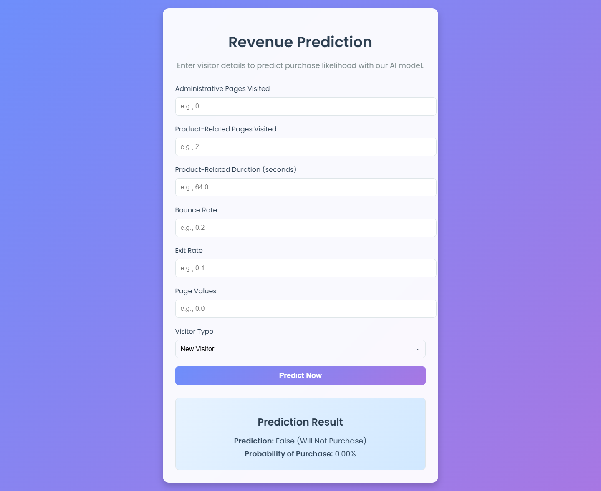

# Revenue Prediction Flask App

This is a Flask web application that provides real-time predictions for whether a website visitor will make a purchase (`Revenue`) based on input features. It uses a pre-trained Keras model (`my_model.keras`) to predict the binary target (`True` for purchase, `False` for no purchase) and displays results in a modern, user-friendly interface.



## Features
- **Real-Time Predictions**: Users input visitor data through a web form, and the app predicts purchase likelihood with probability.
- **Input Fields**:
  - `Administrative`: Number of administrative pages visited.
  - `ProductRelated`: Number of product-related pages visited.
  - `ProductRelated_Duration`: Time spent on product-related pages (seconds).
  - `BounceRates`: Bounce rate for the session.
  - `ExitRates`: Exit rate for the session.
  - `PageValues`: Value of pages visited.
  - `VisitorType`: Type of visitor (`New_Visitor`, `Other`, `Returning_Visitor`).
- **Beautiful UI**: Modern design with gradients, animations, and a glassmorphism effect, styled using `style.css` and Animate.css.
- **Error Handling**: Validates user inputs and displays errors for invalid data.

## Project Structure
```
revenue-prediction/
├── app.py                  # Flask application script
├── my_model.keras          # Pre-trained Keras model
├── templates/
│   └── index.html          # HTML template for the web interface
├── static/
│   ├── style.css           # Custom CSS for styling
│   └── favicon.ico         # Favicon for the app (optional)
├── requirements.txt        # Python dependencies
├── README.md               # This file

```

## Prerequisites
- Python 3.8+
- A trained Keras model (`my_model.keras`) that expects 7 input features in the order: `Administrative`, `ProductRelated`, `ProductRelated_Duration`, `BounceRates`, `ExitRates`, `PageValues`, `VisitorType` (encoded as 0=New_Visitor, 1=Other, 2=Returning_Visitor).

## Installation
1. **Clone the Repository**:
   ```
   git clone https://github.com/jarif87/predictive-revenue-analytics.git
   ```
2. **Create a Virtual Environment:**
```
python -m venv venv
source venv/bin/activate  # On Windows: venv\Scripts\activate
```
3. **Install Dependencies:**
```
pip install -r requirements.txt
```

## Usage
- Run the App Locally:
```
python app.py
```

## Make Predictions:
- Enter values for the six numeric fields (Administrative, ProductRelated, etc.) as text inputs.
- Select a VisitorType from the dropdown (New Visitor, Other, Returning Visitor).
- Click "Predict Now" to see the prediction (True (Will Purchase) or False (Will Not Purchase)) and the probability of purchase.
- Errors (e.g., invalid numbers) are displayed in a red box.

## Dependencies
- Listed in requirements.txt:
```
tensorflow==2.18.0
numpy==1.26.4
pandas==2.2.3
keras==3.8.0
Flask==3.1.1
```